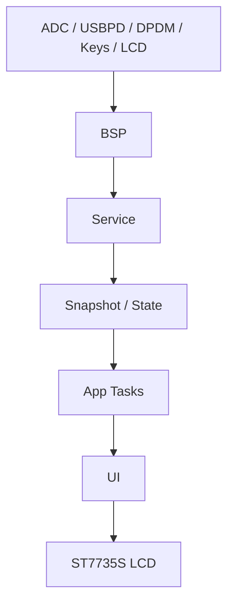
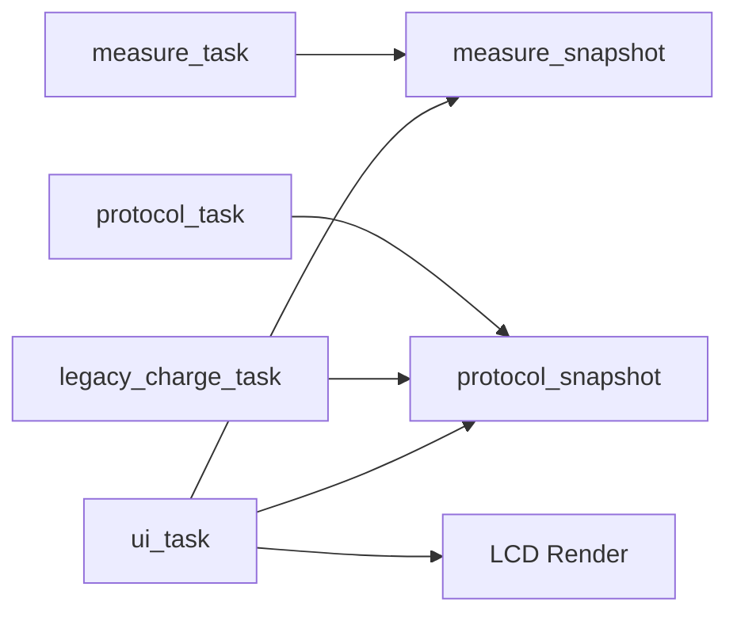

# Hiveton Power X

`Hiveton Power X` 是一套基于 `CH32L103K8U6` 的 USB 电源检测仪固件工程，目标是实现一款类似 `Power-Z` 的便携式 USB/Type-C 电源测试设备。

当前仓库已经包含：

- `CH32L103K8U6 + FreeRTOS` 的主工程框架
- 面向 PX1 硬件的 `BSP / Service / UI / App` 分层代码
- 电压、电流、功率、趋势级纹波的测量链路骨架
- `PD` 监听与请求、`E-Marker` 摘要、`QC/AFC/FCP` 传统快充诱骗骨架
- `0.96" ST7735S` 彩屏的低内存 UI 渲染框架
- 原理图、原厂 `EVT` 例程、屏幕参考代码、设计规格和实施计划

项目当前仍处于 `bring-up + MVP 开发` 阶段，已经完成软件架构搭建和主要功能链路收口，后续重点是继续补齐真实硬件参数、板级调试和协议细节。

## 项目状态总览

| 模块 | 当前状态 | 说明 |
| --- | --- | --- |
| 测量框架 | 已接入 | 已有 `ADC/DMA + snapshot` 骨架，电流工程值仍待标定 |
| 纹波 | MVP | 当前为趋势级估算，不是示波器级 |
| PD | 持续完善中 | 已有监听、请求、快照和基础协商路径 |
| QC/AFC/FCP | 框架已立 | 请求模型和底层接口已接上，兼容性细节继续补齐 |
| E-Marker | 基础支持 | 当前以摘要信息为主 |
| LCD/UI | 已接入 | `ST7735S + line buffer`，主/协议/诱骗页已成型 |
| 按键交互 | 已接入 | 3 键导航与诱骗页选档/确认已落地 |
| 文档 | 已建立 | 原理图、规格、计划、bring-up 模板都已入库 |

## 1. 项目目标

这个项目要做的是一套完整的 USB 检测仪固件，面向以下典型能力：

- 实时测量 `VBUS 电压 / 电流 / 功率`
- 提供 `趋势级纹波` 观察能力
- 监测 `Type-C / PD / QC / AFC / FCP`
- 支持主动诱骗，请求目标电压档位
- 读取线缆 `E-Marker` 关键摘要信息
- 在小尺寸彩屏上提供低 RAM 占用的 UI

项目第一阶段偏向 `MVP`，强调：

- 开机即用
- 数值可快速读取
- 协议状态清晰
- 框架可扩展
- 在 `CH32L103K8U6` 资源约束下尽量保持模块边界清楚

## 2. 硬件平台

主控与主要硬件条件如下：

- MCU：`CH32L103K8U6`
- Type-C/PD：使用芯片自带 `USBPD` 硬件
- 屏幕：`0.96 寸 LCD 彩屏`，驱动 `ST7735S`
- 交互：`3 个按键`
- 软件框架：基于你现有的 `FreeRTOS` 工程继续开发

当前代码已经按原理图收口的关键板级映射集中在：

- [`bsp_board_config.h`](/Users/hiveton/HivetonCode/HivetonPowerX/PowerXCode/FreeRTOS/Bsp/include/bsp_board_config.h)

其中包括：

- `LCD_SPI_DC / RST / CS / SCK / MOSI`
- `LCD_BL_PWM`
- `BTN_1 / BTN_2 / BTN_3`
- `CC1 / CC2`
- `USB_DP / USB_DM`
- `VBUS / CURRENT ADC`
- `CC1_EXT_RD_CTL`

## 3. 当前功能范围

### 已经落地的部分

- `FreeRTOS` 多任务骨架
- `ADC/DMA` 测量服务骨架
- `PD` 快照模型与基础协商流程
- `legacy charge` 请求模型
- `ST7735S` 硬件 SPI / DMA 像素推送框架
- 主页面、协议页面、诱骗页面的低内存渲染路径
- 主机侧单元测试

### 当前重点中的部分

- 电流测量前端工程量参数标定
- `QC/AFC/FCP` 真实电平时序细化
- `PD` 更完整的实机协商闭环
- `E-Marker` 深度读取
- 页面细节、统计页和板级 bring-up

### 暂未完成或仍保守处理的部分

- 高可信绝对纹波测量
- 完整传统快充被动识别兼容性
- 上位机通信协议
- 量产级校准与出厂参数流程

## 4. 软件架构

工程按 `BSP -> Service -> UI -> App` 分层组织。

### 架构总览



其中每层关注点如下：

- `BSP`：只负责访问硬件能力
- `Service`：负责测量算法、协议状态机、请求模型
- `App`：在 FreeRTOS 任务中组织系统行为
- `UI`：只消费快照并渲染页面，不直接操控底层协议

### `Bsp`

职责是板级驱动和外设抽象，不直接承载产品策略。

主要文件：

- [`bsp_adc_dma.c`](/Users/hiveton/HivetonCode/HivetonPowerX/PowerXCode/FreeRTOS/Bsp/bsp_adc_dma.c)
- [`bsp_usbpd_port.c`](/Users/hiveton/HivetonCode/HivetonPowerX/PowerXCode/FreeRTOS/Bsp/bsp_usbpd_port.c)
- [`bsp_dpdm.c`](/Users/hiveton/HivetonCode/HivetonPowerX/PowerXCode/FreeRTOS/Bsp/bsp_dpdm.c)
- [`bsp_lcd_st7735.c`](/Users/hiveton/HivetonCode/HivetonPowerX/PowerXCode/FreeRTOS/Bsp/bsp_lcd_st7735.c)
- [`bsp_backlight.c`](/Users/hiveton/HivetonCode/HivetonPowerX/PowerXCode/FreeRTOS/Bsp/bsp_backlight.c)
- [`bsp_keys.c`](/Users/hiveton/HivetonCode/HivetonPowerX/PowerXCode/FreeRTOS/Bsp/bsp_keys.c)
- [`bsp_cc_ext_rd.c`](/Users/hiveton/HivetonCode/HivetonPowerX/PowerXCode/FreeRTOS/Bsp/bsp_cc_ext_rd.c)

设计原则：

- 尽量只提供“硬件能力”
- 避免把产品逻辑写进驱动层
- 所有板级映射统一收口到 `bsp_board_config.h`

### `Service`

职责是协议、测量、快照和算法逻辑，是 UI 与驱动之间的业务层。

主要文件：

- [`service_measure.c`](/Users/hiveton/HivetonCode/HivetonPowerX/PowerXCode/FreeRTOS/Service/service_measure.c)
- [`service_pd.c`](/Users/hiveton/HivetonCode/HivetonPowerX/PowerXCode/FreeRTOS/Service/service_pd.c)
- [`service_legacy_charge.c`](/Users/hiveton/HivetonCode/HivetonPowerX/PowerXCode/FreeRTOS/Service/service_legacy_charge.c)
- [`service_emark.c`](/Users/hiveton/HivetonCode/HivetonPowerX/PowerXCode/FreeRTOS/Service/service_emark.c)
- [`service_protocol_snapshot.h`](/Users/hiveton/HivetonCode/HivetonPowerX/PowerXCode/FreeRTOS/Service/include/service_protocol_snapshot.h)

设计原则：

- 使用轻量状态机
- 用快照结构给 UI 提供只读数据
- 尽量保留主机侧可测试性

### `UI`

职责是页面模型、低内存绘制和按键驱动下的页面行为。

主要文件：

- [`ui_model.c`](/Users/hiveton/HivetonCode/HivetonPowerX/PowerXCode/FreeRTOS/UI/ui_model.c)
- [`ui_pages.c`](/Users/hiveton/HivetonCode/HivetonPowerX/PowerXCode/FreeRTOS/UI/ui_pages.c)
- [`ui_renderer.c`](/Users/hiveton/HivetonCode/HivetonPowerX/PowerXCode/FreeRTOS/UI/ui_renderer.c)
- [`ui_widgets.c`](/Users/hiveton/HivetonCode/HivetonPowerX/PowerXCode/FreeRTOS/UI/ui_widgets.c)

UI 设计重点：

- 不使用全屏 framebuffer
- 采用 `line buffer + 分区刷新`
- 默认面向“快速看数值”
- 兼顾协议页和诱骗页

### `App`

职责是把测量、协议、UI 和系统任务拼起来，形成最终产品行为。

主要文件：

- [`app_controller.c`](/Users/hiveton/HivetonCode/HivetonPowerX/PowerXCode/FreeRTOS/App/app_controller.c)
- [`app_tasks.c`](/Users/hiveton/HivetonCode/HivetonPowerX/PowerXCode/FreeRTOS/App/app_tasks.c)
- [`app_trigger_control.c`](/Users/hiveton/HivetonCode/HivetonPowerX/PowerXCode/FreeRTOS/App/app_trigger_control.c)

当前任务模型大致是：

- `measure_task`
- `protocol_task`
- `legacy_charge_task`
- `ui_task`

### 任务关系



## 5. 代码目录结构

仓库根目录的主要结构如下：

```text
HivetonPowerX/
├── README.md
├── PowerXCode/
│   ├── FreeRTOS/
│   │   ├── App/          # 应用层与任务组织
│   │   ├── Assets/       # 字体等静态资源
│   │   ├── Bsp/          # 板级驱动
│   │   ├── FreeRTOS/     # 内核源码
│   │   ├── Ld/           # 链接脚本
│   │   ├── Service/      # 测量/协议/快充业务层
│   │   ├── Startup/      # 启动文件
│   │   ├── Tests/        # 主机侧测试
│   │   ├── UI/           # 页面模型与渲染
│   │   ├── User/         # 工程入口、配置、中断
│   │   └── obj/          # MRS 工程生成的构建目录
│   └── SRC/              # CH32L103 外设库与底层源码
└── docs/
    ├── SCH_HivetonPX1_2026-04-03.pdf
    ├── EVT/              # 原厂参考例程
    ├── 0.96IPS.../       # 屏幕资料与参考代码
    ├── board-bringup-template.md
    └── superpowers/
        ├── specs/        # 设计规格
        └── plans/        # 实施计划
```

## 6. 关键数据流

系统的主要数据流可以概括成：

1. `BSP` 从 ADC、USBPD、DPDM、按键、LCD 等外设取数或发命令
2. `Service` 把原始输入变成测量结果、协议状态和诱骗请求
3. `App` 在任务里协调这些服务并发布共享快照
4. `UI` 消费快照并绘制到 ST7735S 屏幕

可以简单理解为：

```text
ADC/USBPD/DPDM/KEY
        ↓
       BSP
        ↓
    Service Layer
        ↓
   Snapshot / State
        ↓
        UI
        ↓
      LCD
```

其中最重要的几个共享模型是：

- `measure_snapshot_t`
- `protocol_snapshot_t`
- `legacy_charge_request_t`
- `ui_model_state_t`

## 7. 诱骗控制逻辑

当前诱骗页已经有一条最小闭环：

1. `BTN_1 / BTN_3` 在 `5V / 9V / 12V / 15V / 20V` 之间切换
2. `BTN_2` 依据当前协议类型下发目标请求
3. `PD` 目标电压走 `service_pd`
4. `QC/AFC/FCP` 目标电压走 `service_legacy_charge`

关键入口文件：

- [`app_trigger_control.c`](/Users/hiveton/HivetonCode/HivetonPowerX/PowerXCode/FreeRTOS/App/app_trigger_control.c)
- [`ui_model.c`](/Users/hiveton/HivetonCode/HivetonPowerX/PowerXCode/FreeRTOS/UI/ui_model.c)
- [`ui_renderer.c`](/Users/hiveton/HivetonCode/HivetonPowerX/PowerXCode/FreeRTOS/UI/ui_renderer.c)

## 8. UI 与交互

当前 UI 主要围绕 3 键工作：

- `BTN_1`：翻页或在诱骗页中减档
- `BTN_2`：确认，长按回主页面
- `BTN_3`：翻页或在诱骗页中加档

当前页面方向：

- `Main`：大数值主视图
- `Protocol`：协议状态与合同信息
- `Trigger`：目标电压预置与主动诱骗
- `Stats`：统计页，后续继续完善

诱骗页目前已经支持 `5V / 9V / 12V / 15V / 20V` 预置选择，并能根据当前协议类型把请求分发到 `PD` 或 `legacy charge` 服务层。

## 9. 推荐阅读顺序

如果你刚接手这个项目，建议按下面顺序建立上下文：

1. 先看原理图和板级配置，确认硬件资源
2. 再看 `app_tasks.c`，理解系统任务是怎么拼起来的
3. 然后看 `service_measure.c / service_pd.c / service_legacy_charge.c`
4. 最后看 `ui_model.c / ui_renderer.c`，理解页面和交互

对应文件入口：

- [`SCH_HivetonPX1_2026-04-03.pdf`](/Users/hiveton/HivetonCode/HivetonPowerX/docs/SCH_HivetonPX1_2026-04-03.pdf)
- [`bsp_board_config.h`](/Users/hiveton/HivetonCode/HivetonPowerX/PowerXCode/FreeRTOS/Bsp/include/bsp_board_config.h)
- [`app_tasks.c`](/Users/hiveton/HivetonCode/HivetonPowerX/PowerXCode/FreeRTOS/App/app_tasks.c)
- [`service_measure.c`](/Users/hiveton/HivetonCode/HivetonPowerX/PowerXCode/FreeRTOS/Service/service_measure.c)
- [`service_pd.c`](/Users/hiveton/HivetonCode/HivetonPowerX/PowerXCode/FreeRTOS/Service/service_pd.c)
- [`service_legacy_charge.c`](/Users/hiveton/HivetonCode/HivetonPowerX/PowerXCode/FreeRTOS/Service/service_legacy_charge.c)
- [`ui_renderer.c`](/Users/hiveton/HivetonCode/HivetonPowerX/PowerXCode/FreeRTOS/UI/ui_renderer.c)

## 10. 参考资料与设计文档

仓库内的重要资料：

- 原理图：
  - [`SCH_HivetonPX1_2026-04-03.pdf`](/Users/hiveton/HivetonCode/HivetonPowerX/docs/SCH_HivetonPX1_2026-04-03.pdf)
- 板级 bring-up 模板：
  - [`board-bringup-template.md`](/Users/hiveton/HivetonCode/HivetonPowerX/docs/board-bringup-template.md)
- MVP 设计规格：
  - [`2026-04-04-hiveton-px1-mvp-design.md`](/Users/hiveton/HivetonCode/HivetonPowerX/docs/superpowers/specs/2026-04-04-hiveton-px1-mvp-design.md)
- MVP 实施计划：
  - [`2026-04-04-hiveton-px1-mvp.md`](/Users/hiveton/HivetonCode/HivetonPowerX/docs/superpowers/plans/2026-04-04-hiveton-px1-mvp.md)
- 原厂参考代码：
  - `docs/EVT`
- 屏幕参考代码与资料：
  - `docs/0.96IPS京东方焊接13pin-ST7735S技术资料`

## 11. 构建与开发说明

当前主工程是：

- `PowerXCode/FreeRTOS`

工程特点：

- 使用 `MRS` 工程文件
- `obj/` 目录中保存工程生成的构建脚本与输出
- 部分主机侧测试可以直接用本机 `cc` 编译运行

当前仓库更适合这样理解：

- `交叉编译与下载`：在本地 IDE / 工具链环境中完成
- `业务逻辑验证`：优先通过 `Tests/` 下的主机侧测试推进

当前已经存在的主机侧测试包括：

- `test_measure_service`
- `test_protocol_snapshot`
- `test_legacy_charge_and_emark`
- `test_ui_model`
- `test_ui_pages`
- `test_app_trigger_control`

### IDE 构建

当前默认开发方式是使用 `MRS` 打开：

- [`PowerXCode/FreeRTOS/.project`](/Users/hiveton/HivetonCode/HivetonPowerX/PowerXCode/FreeRTOS/.project)
- [`PowerXCode/FreeRTOS/.cproject`](/Users/hiveton/HivetonCode/HivetonPowerX/PowerXCode/FreeRTOS/.cproject)

构建输出目录：

- `PowerXCode/FreeRTOS/obj`

主要构建产物名称：

- `FreeRTOS.elf`
- `FreeRTOS.hex`
- `FreeRTOS.lst`
- `FreeRTOS.siz`

### 命令行构建

当前工程的自动生成 `makefile` 位于：

- [`PowerXCode/FreeRTOS/obj/makefile`](/Users/hiveton/HivetonCode/HivetonPowerX/PowerXCode/FreeRTOS/obj/makefile)

从当前仓库已知信息来看，命令行构建依赖以下工具链：

- `riscv-none-embed-gcc`
- `riscv-none-embed-objcopy`
- `riscv-none-embed-objdump`
- `riscv-none-embed-size`

在工具链已正确安装的前提下，常见构建入口是：

```bash
cd PowerXCode/FreeRTOS/obj
make -j10 all
```

清理命令：

```bash
cd PowerXCode/FreeRTOS/obj
make clean
```

### 当前下载/烧录说明

当前仓库里还没有完全固定的命令行烧录脚本，因此更推荐：

- 先在 IDE 内完成构建
- 再通过你当前实际使用的下载方式把 `FreeRTOS.hex` 或 `FreeRTOS.elf` 烧录到板子

换句话说，当前仓库已经把“构建”路径收出来了，但“统一烧录脚本”还没有在仓库里正式固化。

### 常见构建问题

1. `fatal error: xxx.h: No such file or directory`
这类错误通常不是源码本身缺失，而是 `MRS` 工程没有重新读取 `.cproject`，先 `Clean` 再完整重编一次。

2. `riscv-none-embed-gcc: command not found`
说明本机还没有安装 CH32L103 对应的 RISC-V 工具链，当前命令行构建无法继续。

3. `Tests/*.c` 参与了嵌入式工程编译
这些测试是主机侧测试，不应该作为板级固件对象参与最终链接。如果 IDE 又重新生成了错误规则，需要重新检查 `.cproject` 的 source path 和过滤设置。

4. `UI` 或 `Bsp` 新增头文件找不到
优先检查 `.cproject` 中是否已经包含：

- `App/include`
- `Bsp/include`
- `Service/include`
- `UI/include`
- `Assets`

5. 板上运行但数值不可信
优先检查：

- [`bsp_board_config.h`](/Users/hiveton/HivetonCode/HivetonPowerX/PowerXCode/FreeRTOS/Bsp/include/bsp_board_config.h)
- [`board-bringup-template.md`](/Users/hiveton/HivetonCode/HivetonPowerX/docs/board-bringup-template.md)

重点确认 `VBUS 分压比`、`CURRENT 零点/增益`、`LCD/按键/背光` 以及 `DP/DM` 模拟链路。

如果后续继续完善仓库文档，建议优先再补：

- IDE 构建步骤
- 命令行构建步骤
- 烧录步骤
- 板级 bring-up 检查表

## 12. 当前限制

这个仓库当前有一些已知边界，阅读代码时建议先知道：

- `电流/功率` 的最终工程值仍依赖真实前端参数和标定
- `纹波` 当前是趋势级，不是示波器级测量
- `legacy charge` 仍以可扩展框架和请求模型为主
- `E-Marker` 当前以摘要信息为主
- `obj/` 目录带有工程生成文件，后续是否继续纳入版本管理可以再收敛

## 13. 后续方向

接下来的主要工作会集中在：

- 板级真实参数补齐与校准
- `PD/QC/AFC/FCP` 实机调试
- 统计页与更多 UI 细节
- 协议快照合并策略完善
- 构建、烧录、测试文档补齐

## 14. Bring-up 建议顺序

如果现在要继续把固件从“框架可跑”推进到“板上可用”，建议按这个顺序推进：

1. 先确认 `LCD / 背光 / 按键` 板级行为
2. 再确认 `VBUS / CURRENT` ADC 工程量换算
3. 接着验证 `PD attach / Source Cap / Request / PS_RDY`
4. 然后补 `QC/AFC/FCP` 的真实对端兼容性
5. 最后做 UI 细节、统计页和整体体验收尾

对应参考文档：

- [`board-bringup-template.md`](/Users/hiveton/HivetonCode/HivetonPowerX/docs/board-bringup-template.md)

---

如果你是第一次进入这个仓库，建议从这几个文件开始看：

- [`bsp_board_config.h`](/Users/hiveton/HivetonCode/HivetonPowerX/PowerXCode/FreeRTOS/Bsp/include/bsp_board_config.h)
- [`app_tasks.c`](/Users/hiveton/HivetonCode/HivetonPowerX/PowerXCode/FreeRTOS/App/app_tasks.c)
- [`service_measure.c`](/Users/hiveton/HivetonCode/HivetonPowerX/PowerXCode/FreeRTOS/Service/service_measure.c)
- [`service_pd.c`](/Users/hiveton/HivetonCode/HivetonPowerX/PowerXCode/FreeRTOS/Service/service_pd.c)
- [`ui_renderer.c`](/Users/hiveton/HivetonCode/HivetonPowerX/PowerXCode/FreeRTOS/UI/ui_renderer.c)

这样能最快建立对这个项目“硬件、协议、任务、UI”四条主线的整体理解。
